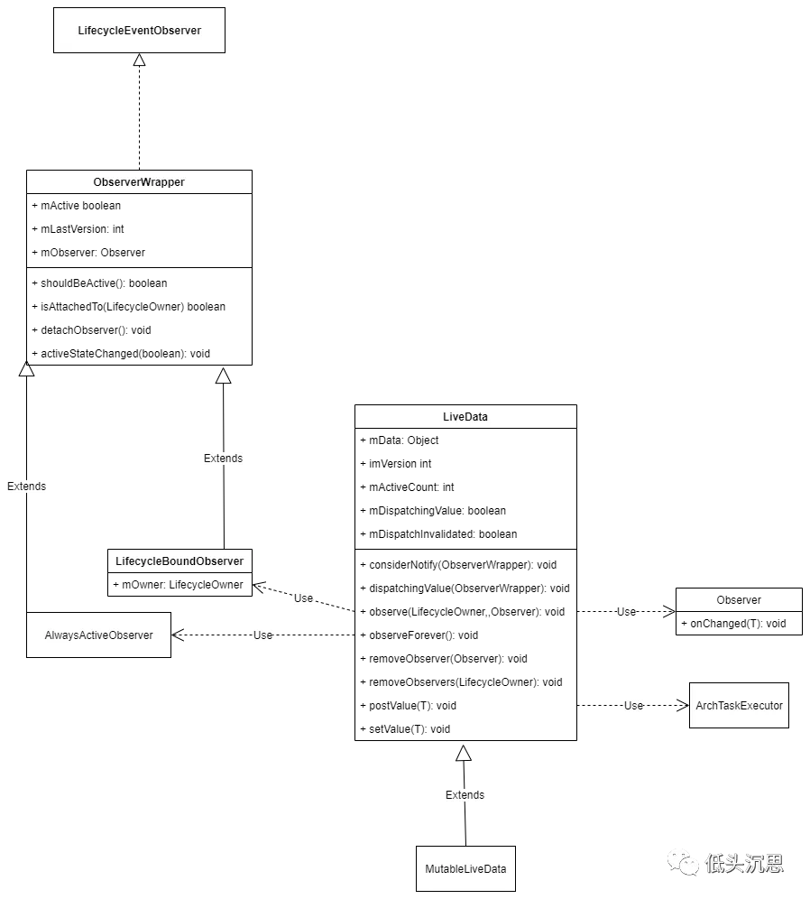

> 上一篇我们讲到了架构组件中的Lifecycle，由于缺少具体的运用，可能缺少直观的感受，今天我们就用Lifecycle实战一回，看看Lifecycle是怎样运用到LiveData中的。

# LiveData的功能
根据`LiveData`的类注释，我们可以知道，`LiveData`是一个实现了观察者模式的数据容器，并且是可感知生命周期的。由这个功能描述，我们就能知道`LiveData`是由两部分功能合并而来的，一部分是数据容器，一部分是响应生命周期。在阅读源码的时候，我觉得功能拆解是个很有用的手段，合理的功能拆解，就是有目的的省略，有助于快速理清功能实现逻辑。
接下来，我将以这两个功能为突破点，逐一梳理`LiveData`的实现思路。

## LiveData的数据容器功能
数据容器的概念相信大家不会陌生，几乎每种语言都会有他们的身影，开发者用它们来保存数据对象。由于应用场景的不同，出现了各种各样的数据容器，如`List`,`Set`这些是保存数据集的，`ThreadLocal`是保存线程私有数据的。那么`LiveData`是保存什么数据的呢，它是保存可观察数据的。
对于数据容器的拆解，其实是有固定的模式可寻的，就是以添加数据为突破口，然后以数据流向为主线，逐步击破。所以我们就从`LiveData`添加数据的方法`setValue`开始分析。

1. `setValue`方法的逻辑很少，主要就是两个，增加mVersion的版本，保存数据，然后就是调用`dispatchingValue`进行分发了。`mVersion`是个关键点，后面还会讲到，这里主要是混个脸熟。我们先进入到下一步。
2. `dispatchingValue`的功能很清楚，从名字上就能看出来，就是分发数据的。但是它的实现却是很巧妙的。为了阐述这个实现，我们需要一个合适的场景。假设当前`LiveData`保存的数据变动频繁，并且观察对象很多的情况，我们怎样快速，准确地把数据传递给观察者呢？或者换种说法，当我们正在分发数据的时候，又有新数据来了怎么办？通常来说有两种方案，掐头去尾。掐头就是在数据更新的时候不管新数据，先把分发操作执行完之后再处理新数据。去尾就是新数据来了，取消上一次数据分发，重新分发新数据。`LiveData`采用的是去尾的方式。明白了这点，再看`dispatchingValue`就很清晰了，它用`mDispatchingValue`标识分发状态，用`mDispatchInvalidated`来标识新数据状态，然后在使用`for`循环分发数据的时候检测`mDispatchInvalidated`的状态是不是更新了，由此确定是不是需要取消此次分发，进行新一轮的分发。其他的就没有更多奥秘可言了。
3. `considerNotify`是分发给具体的观察者之后的处理逻辑。这一步就是在步骤2中的`for`循环里完成的。所以这里就是数据的最后一站了。这个方法需要根据观察者的两个状态来确定是不是要通知。一个就是步骤1中提到的`mVersion`，因为观察者也有一份自己的`mLastVersion`,假如`mVersion`比`mLastVersion`小的话就没必要通知了，因为每次通知之后，它两的值是一样的。另一个就是和生命周期扯上关系的`mActive`了。这个状态标示着当前的观察者是否处于激活状态。假如不是，则直接返回了。搞了这两个判断之后就是简单的更新`mLastVersion`和执行`onChanged`回调了。
以上三步就是`LiveData`的数据更新过程，重点在于处理分发这个步骤上，在以后的项目中，我们可以借鉴这种思想，当然具体问题是需要具体分析的。
在上面的步骤3中我们知道了观察者的`mActive`是决定`LiveData`响应生命周期的关键，那么接下来我们来看看这个状态是怎么更新的吧。

## LiveData的生命周期感知
联系上一篇文章沉思篇-剖析JetPack的`Lifecycle`,我们知道`Lifecycle`是专业干介个的（生命周期感知）。同时文章也提到了`Lifecycle`三个很重要的抽象，`LifecycleOwner`，`Lifecycle`，`LifecycleObserver`，这是引入生命周期感知三个很好的突破口。

- `LifecycleOwner`作为生命周期的动力源，是直接可以获得Lifecycle的，继而可以方便地读取状态和注册状态监听，由于出色的接口封装，不需要和其他类产生耦合，是个很好的引入对象。
- `Lifecycle`作为`Lifecycle`的核心类，它完成了很多功能，是抽象类，只能继承使用。
- `LifecycleObserver`，作为状态更新通知的最后一环，可以很方便地完成状态监听，但是需要注册到合适的`Lifecycle`上。

所以很显然，`LiveData`使用`Lifecycle`需要搞一个`LifecycleOwner`，用于引入生命周期的状态，还需要搞一个`LifecycleObserver`，用于响应状态更新。另外，由于我们是数据容器的定位，我们的数据是很可能供给给很多类使用的，所以假如将`LifecycleOwner`和`LiveData`绑定的话，一旦某个操作致使`LiveData`失活，其他所有的观察者就一摸黑了，啥也收不到了，这是有悖设计的。基于这个原因，`LifecycleOwner`只能和`Observer`绑定。结果就显而易见了，他们同时出现在了`observe`方法里，这也就解释了`observe`方法为啥需要两个参数。
很明显`observe`就是分析生命周期感知的突破口，我们再接再励，看看他们是怎么合力工作的。

在`observe`内部，`LifecycleOwner`和`Observer`同时被`LifecycleBoundObserver`接收，用于构造对象了，逻辑继续转到`LifecycleBoundObserver`中.

注意到`LifecycleBoundObserver`是实现了`LifecycleEventObserver`,并且继承自`ObserverWrapper`。`ObserverWrapper`不熟悉我们先放一边，上一篇中我们知道了`LifecycleEventObserver`是继承自`LifecycleObserver`的，它只有一个状态变更的回调。很显然，我们下一步就是去看看它是怎样处理状态变更的。

来到`onStateChanged`方法，里面做了两件事，而且是互斥的，这就是说，其实它在某种条件下干一件事，其他条件干另一个事。先看简单的一件事，它在`Lifecycle`状态是`DESTROYED``的时候移除了`Observer`，没有更多了。那么另一件事其实我们也能猜到了，就是状态不为`DESTROYED`的时候怎么搞。它委托给了父类`ObserverWrapper`搞。

逻辑来到`ObserverWrapper`的`activeStateChanged`方法里，里面就是对`LiveData`的状态进行设置而已，也就是根据现在是不是激活状态更新`mActiveCount`的值，并且在适当的条件下通知`LiveData`进入激活状态或者失活状态。另外就是上面我们心心念念的`mActive`了，这就接上了。当然，还有个极为关键的点，在激活状态下，会以自身为参数，进行一次数据数据，在某种情况下，这可能会引入数据问题。

到这里，`LiveData`的生命周期感知就看完了.一句话就能总结，`Lifecycle`让`LiveData`有了在激活状态下分发数据，在失活后自动取消监听的能力。

补充说明
虽然前面讲了那么多，还有一些内容是没有讲到的，比如数据的异步更新，`Observer`的注册过程，等等，但是已经不妨碍我们理解主流程了。为了加深印象，我还整理一个UML图，可以对照着图再次理解，回顾。
