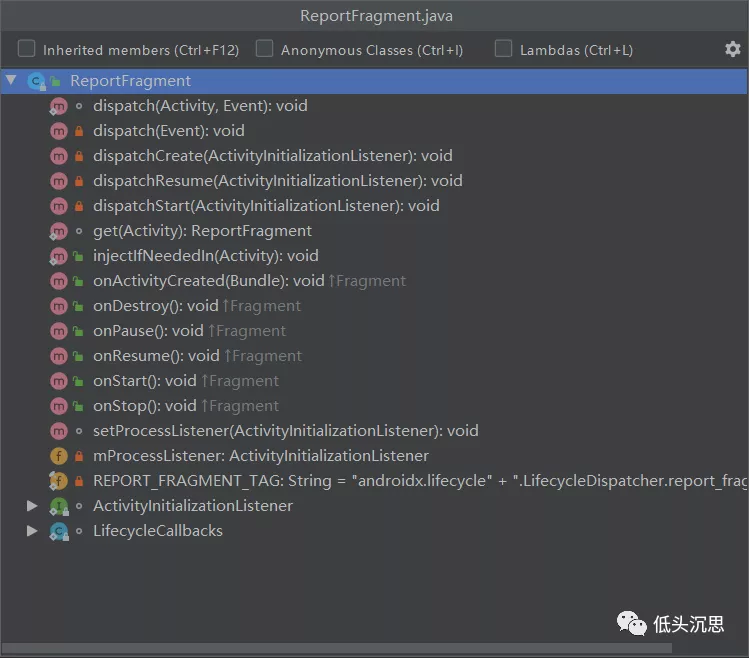
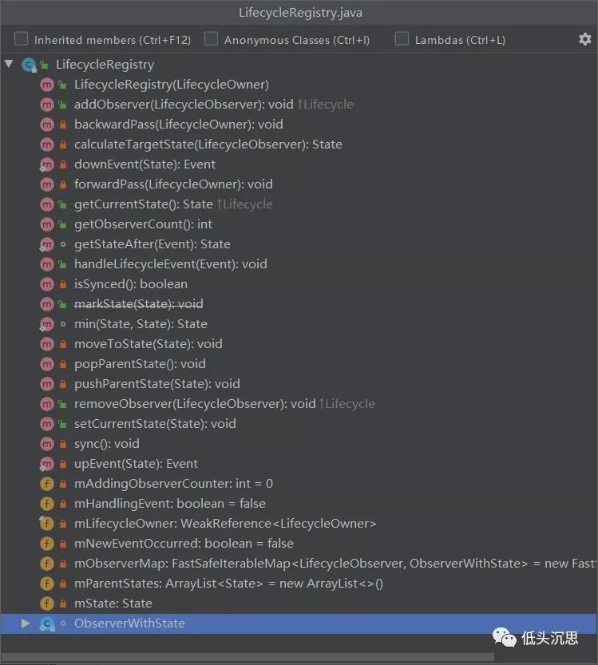
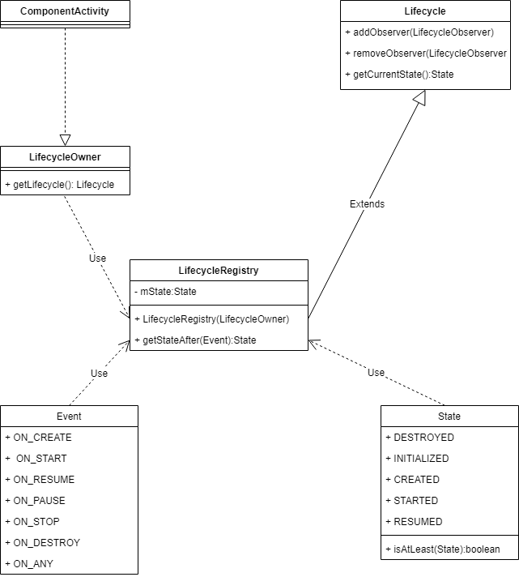

> 这几年，对于Android开发者来说，最时髦的技术当属Jetpack了。谷歌官方从19年开始，就在极力推动Jetpack的使用，经过这几年的发展，Jetpack也基本完成了当时的设计目标——简单，一致，专注。而使得这一切成为可能的基石，我觉得当属架构组件了。最初架构组件作为单独的库和support库并没有太多联系，随着Jetpack的成型，给架构组件也注入了新的活力。在Jetpack库中，建构组件的使用随处可见，扮演着越来越重要的角色。今天，我就以作为架构组件基石的Lifecycle开始，尝试对架构组件进行剖析，向大家展示谷歌开发者是怎样设计一个高内聚，低耦合的库的。
<!--more-->
### 前言
要说阅读源码，我觉得和把大象装进冰箱的操作是一样的，就是再大的事，得分步骤。阅读源码的第一步就是站在库开发者的角度，提炼出库需要完成的功能。明确了功能，才能针对功能进行代码设计，这也是我们阅读源码的第二步，理清实现逻辑。我们可以通过画UML图的方式帮助理解。通常来说画完UML图，源码的理解也就七七八八了。这时我们就可以走到第三步，品读实现细节。有了前两步的基础，我们就可以针对性地选取一些感兴趣的内容研读实现了，而且可以做到收放自如，指哪打哪。
那我们开始吧！

### Lifecycle的源码思路
明确Lifecycle的设计目标
一句话概括，Lifecycle就是完成了生命周期感知的任务。生命周期感知是什么意思呢，就是一个类可以不依赖Activity或者Fragment的回调，正确处理状态更新的问题。那么我们为什么需要这样的一个类呢，这和我们直接在回调方法里面写逻辑有什么差别吗？为了回答这个问题，我们来设想一下这样一个场景：一个Activity需要获取用户实时的位置信息，同时需要使用相机，以往我们的做法是在Activity的某些回调里面设置位置，相机的监听及解监听。如果这时，Activity再加入其他的一些逻辑，它的代码就可能膨胀到不能忍受的地步，并且随着业务的增长，后续Activity的膨胀是不可预期的，这样是不利于调试和测试的，而且，从设计上来说，这样的设计也是脆弱的，耦合太紧了。但是我们的这些组件确确实实是需要响应生命周期回调的啊，那么怎样才能做到既能感知生命周期，又能降低耦合呢。计算机科学告诉我们这样一条真理，当找不到其他方法时，可以考虑加一层抽象。由此，Lifecycle诞生了。这就是Lifecycle的目标，很纯粹，就是生命周期感知，就是把专业的事情交给专业的去做。

### Lifecycle的工作流程
概括来说，Lifecycle就是完成了状态监听和状态分发的两个功能。为了完成这两个功能，Lifecycle抽象出了三个概念，也可以说是三个流程吧。
1. 拥有生命周期的对象，称为LifecycleOwner，这其实只是一个接口，只要能提供Lifecycle的都可以称为LifecycleOwner，这个类主要的功能就是提供原始的生命周期事件，供后续的操作提供数据，这是第一步——状态感知；
2. 拥有生命周期状态，称为Lifecycle，这个类主要的功能就是提供状态抽象和提供状态信息，这是第二步——状态更新；
3. 对生命周期状态感兴趣的观察者，称为LifecycleObserver，这个类主要的功能就是对状态信息进行响应，这是第三步——状态响应。

流程很简单，看着也很清晰的，就是观察者模式。但是Lifecycle库为了完成更好的解耦和提供更多的扩展，在这三个环节上衍生出了更多的类，这也是我以Lifecycle为剖析对象的原因。我觉得一个好的库，不仅仅要能够完成库的设计目标，同时还应该保持尽可能的扩展性和可读性。在这点上，Lifecycle无疑是我们很好的榜样。接下来，我们就一起以这三个阶段为主线，逐一剖析Lifecycle是怎样完成抽象，设计，及实现的。

#### Lifecycle的状态感知
传统的状态感知就是重写Activity和Fragment的生命周期回调，在回调里面进行状态更新。这其实也是Lifecycle实现的基本思路，只是它将这些个回调抽象为了一个个的事件。那么怎么将生命周期转化为一个个事件呢？Lifecycle用了一个巧妙的方法，自定义了一个ReportFragment。ReportFragment作用很明确，就是监听生命周期，生成状态事件。

如图所示，本质上ReportFragment还是监听了Activity的生命周期，绑定关系就发生在injectIfNeededIn方法中。然后为了将监听到的状态传递出去给其他类使用，ReportFragment借助了dispatch方法。这里有个很巧妙的设计细节，dispatch并没有直接引用自己的组件，而是使用了Activity，但是为什么还是能将事件发送出去呢？因为这里面使用了动态类型判断及转换的操作，最终，转换成了分发器LifecycleRegistry来完成事件分发操作。从而顺利讲逻辑转到了第二阶段，状态更新。
#### Lifecycle的状态更新
状态更新主要的逻辑还是放在了LifecycleRegistry类里，这个类是继承了Lifecycle的。

如图所示，这个类作为Lifecycle的子类完成了被观察对象的两个功能，接收和管理观察对象。其次作为核心类它又完成了状态更新的功能。事件在这里被转化为状态，保存了下来，然后通知给自己的观察者。从类缩略图中，我们也可以看出这些方法就是为了完成这两大功能而设计的。知道了这些，状态更新的步骤也就了解了。那么顺理成章的，我们马上进入第三个步骤。
#### Lifecycle的状态响应
LifecycleObserver是个空接口，那么状态更新怎么做呢？这就还得从LifecycleRegistry开始看起。LifecycleRegistry在添加LifecycleObserver的时候做了包装，于是LifecycleObserver变成了多种LifecycleObserver的子类，在不同的子类里面其实都直接或者间接地继承自LifecycleEventObserver。所以最终状态是通过LifecycleEventObserver的onStateChanged方法通知给观察者的。但是我们很快发现不对劲，官方Demo是直接实现LifecycleObserver，并且只需要用注解对感兴趣的状态注册就可以了。这里完全没有体现哇。按照刚才的思路，我们还是从添加LifecycleObserver的方法开始，LifecycleObserver被包装成ObserverWithState对象，而在构造方法里面委托给了Lifecycling，所以最终的秘密藏在Lifecycling。Lifecycling里面对多种LifecycleObserver进行了处理，其中就包括了我们熟悉的注解的方式。所以，总结来看，我们通过注解定义LifecycleObserver观察者后，注册到LifecycleRegistry就会被包装成新的观察者对象。然后，在状态更新的时候，用过注解找到合适的方法来通知观察者。到这里其实整个Lifecycle的工作流程已经理清了，我根据这些整理出了一份UML图。

由UML图，我们可以直观地得出一句话的结论，LifecycleRegistry使用LifecycleOwner提供的Lifecycle，使用观察者的模式把状态传递给了LifecycleEventObserver，这就是我最开始说的三个抽象之间的联系。
### 品读实现细节
经过多次的品读，我发现了Lifecycle的多个小细节值得我们细细品味，其一就是Lifecycle强大的抽象。Lifecycle使用了LifecycleOwner抽象了生命周期这个概念，生命周期不一定是和Activity绑定的，用户可以自己定义自己的LifecycleOwner，定制满足自己业务需求的Lifecycle。其次LifecycleRegistry是一个很好的高内聚，低耦合的实现典范——LifecycleRegistry依赖的都是LifecycleOwner和LifecycleObserver这样的顶层接口，遵循了依赖倒置原则、LifecycleRegistry内部对LifecycleObserver的包装又委托给了Lifecycling，遵循了单一职责原则，就连LifecycleRegistry的方法都是严格遵守单一职责原则的，不得不叹服开发者对代码强大的掌控力。
当然，还有其他也很不错的实现细节，我没有一一展开，因为代码是读不完的，我们抓住我们感兴趣的就行了，有些细节就是用来忽略的，我们不得不承认这个事实。

青山不改，绿水长流，咱们下期见！